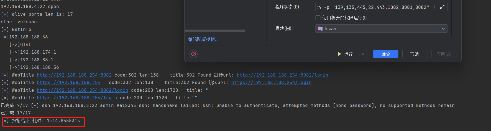
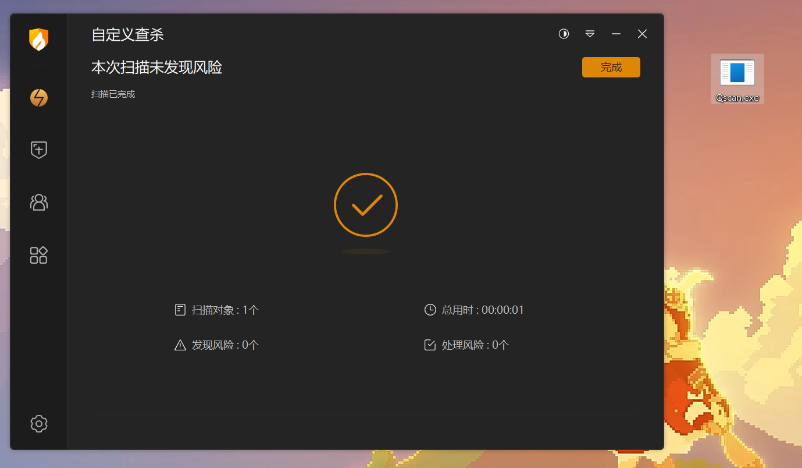
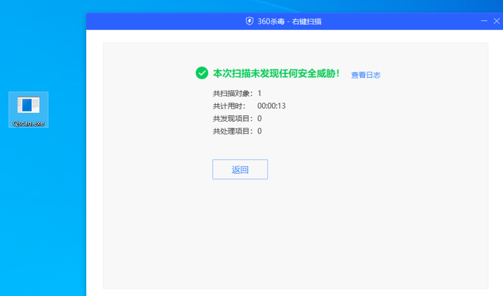
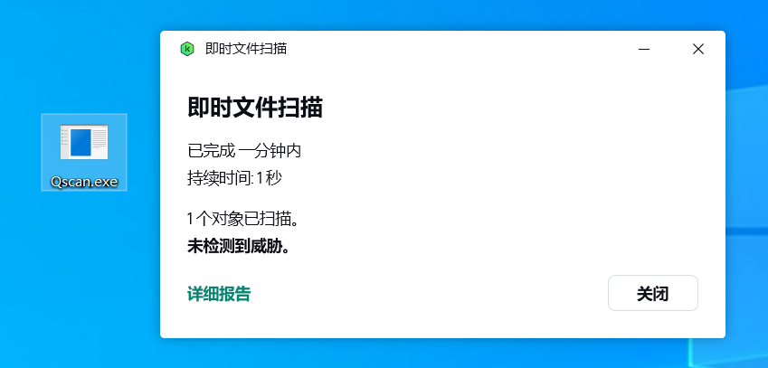

# Qscan

一个比Fscan更快，且免杀的内网扫描器

# 特点

+ 更快的扫描速度

KScan


FScan


+ 免杀







+ 漏洞扫描


+ MS17010检测

## 使用参数

```
optional arguments:
  -h , --help     show this help message and exit
  -f , --fofa     从fofa获取检测对象，需提前配置环境变量:FOFA_EMAIL、FOFA_KEY
  -t , --target   指定探测对象：
                  IP地址：114.114.114.114
                  IP地址段：114.114.114.114/24,不建议子网掩码小于12
                  IP地址段：114.114.114.114-115.115.115.115
                  URL地址：https://www.baidu.com
                  文件地址：file:/tmp/target.txt
                  剪切板: paste or clipboard
  --spy           网段探测模式，此模式下将自动探测主机可达的内网网段可接收参数为：
                  (空)、192、10、172、all、指定IP地址(将探测该IP地址B段存活网关)
options:
  --check         针对目标地址做指纹识别，仅不会进行端口探测
  --scan          将针对--fofa、--spy提供的目标对象，进行端口扫描和指纹识别
  -p , --port     扫描指定端口，默认会扫描TOP400，支持：80,8080,8088-8090
  -eP, --excluded-port 跳过扫描指定的端口，支持：80,8080,8088-8090
  -o , --output   将扫描结果保存到文件
  -oJ             将扫描结果使用json格式保存到文件
  -oC             将扫描结果使用csv格式保存到文件
  -Pn          	  使用此参数后，将不会进行智能存活性探测，现在默认会开启智能存活性探测，提高效率
  -Cn             使用此参数后，控制台输出结果将不会带颜色。
  -Dn             使用此参数后，将关闭CDN识别功能
  -sV             使用此参数后，将对所有端口进行全探针探测，此参数极度影响效率，慎用！
  --top           扫描经过筛选处理的常见端口TopX，最高支持1000个，默认为TOP400
  --proxy         设置代理(socks5|socks4|https|http)://IP:Port
  --threads       线程参数,默认线程100,最大值为2048
  --path          指定请求访问的目录，只支持单个目录
  --host          指定所有请求的头部Host值
  --timeout       设置超时时间
  --encoding      设置终端输出编码，可指定为：gb2312、utf-8
  --match         对资产返回banner进行检索，剔除不存在关键字的结果记录
  --not-match     对资产返回banner进行检索，剔除存在关键字的结果记录
  -hY , --hydra         自动化爆破支持协议：ssh,rdp,ftp,smb,mysql,mssql,oracle,postgresql,mongodb,redis,默认会开启全部
  -eX , --exploit       漏洞探测，使用xray poc
hydra options:
   --hydra-user   自定义hydra爆破用户名:username or user1,user2 or file:username.txt
   --hydra-pass   自定义hydra爆破密码:password or pass1,pass2 or file:password.txt
                  若密码中存在使用逗号的情况，则使用\,进行转义，其他符号无需转义
   --hydra-update 自定义用户名、密码模式，若携带此参数，则为新增模式，会将用户名和密码补充在默认字典后面。否则将替换默认字典。
   --hydra-mod    指定自动化暴力破解模块:rdp or rdp,ssh,smb
exploit options:
   --cookie       设置cookie
   --num          web poc 发包速率  (default 20)
   --dns          使用DnsLog Poc
   --full         poc全扫描，如：shiro 100 key
   --wt           web访问超时时间 (default 5)
fofa options:
   --fofa-syntax  将获取fofa搜索语法说明
   --fofa-size    将设置fofa返回条目数，默认100条
   --fofa-fix-keyword 修饰keyword，该参数中的{}最终会替换成-f参数的值
```